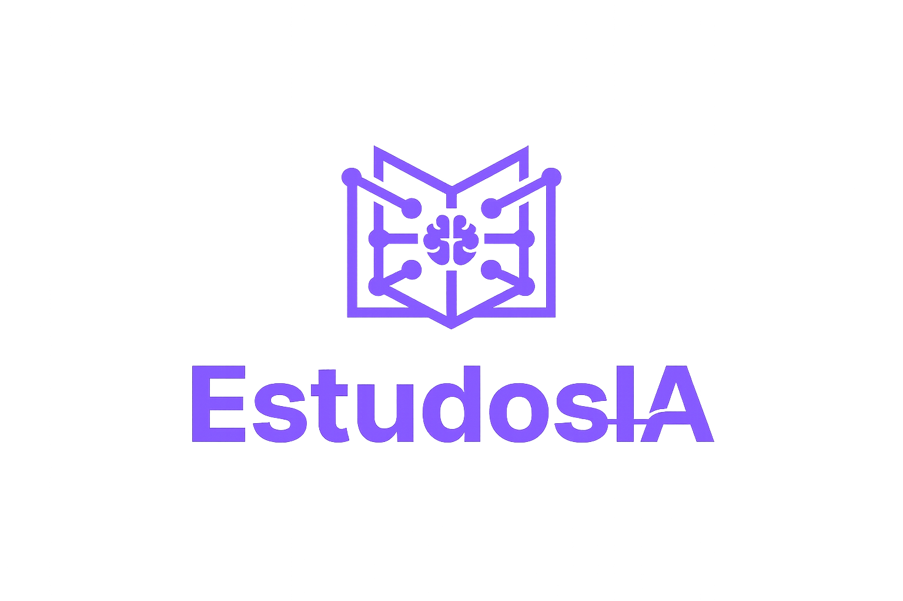

# 📚 EstudosIA - Plataforma Inteligente de Estudo

<div align="center">



**A revolução da educação com Inteligência Artificial**

[]() 
[]() 
[]()

[🌐 Demo](https://estudos-ia.vercel.app/index.html) • [✨ Funcionalidades](#-funcionalidades) • [🚀 Começar](#-começar-rápido) • [📖 Documentação](#-documentação-detalhada)

</div>

---

## 🎯 Sobre o Projeto

**EstudosIA** é uma plataforma web inteligente que utiliza a API do Google Gemini para transformar qualquer material de estudo em recursos educacionais completos. Com um interface moderna e intuitiva, o sistema ajuda estudantes a maximizar seu aprendizado de forma eficiente.

A plataforma permite que você cole qualquer texto ou importe um PDF para gerar automaticamente:
- 📝 **Resumos** estruturados
- ❓ **Questões** para autoavaliação  
- 🎓 **Flashcards** interativos para memorização
- 📊 **Histórico** completo de suas atividades

---

## ✨ Funcionalidades

### 🎨 Dashboard Principal
- **Interface moderna** com tema claro/escuro
- **Entrada flexível** de texto ou upload de PDF
- **Geração instantânea** com loader visual
- **Copiar resultado** com um clique

### 📝 Gerador de Resumos
- Resumos concisos de textos longos
- Preservação dos pontos-chave
- Formatação clara e legível
- Histórico de resumos gerados

### ❓ Gerador de Perguntas
- Criação automática de 5 perguntas por texto
- Perguntas focadas em conceitos importantes
- Ideal para autoteste e revisão
- Histórico persistente

### 🎓 Flashcards Interativos
- Geração de 5-10 cards por sessão
- **Visualização interativa** - clique para virar
- **Navegação fácil** - anterior/próximo
- **Lista completa** de todos os cards
- Contador de progresso

### 🔄 Tema Claro/Escuro
- **Toggle dinâmico** com ícones (🌙 → ☀️)
- Preferência persistida no localStorage
- Transições suaves
- Totalmente responsivo

### ⚙️ Configurações
- Ativar/desativar notificações
- Salvamento automático
- Limite de materiais salvos (20/50/100)
- **Exportar dados** em JSON
- Limpar histórico
- Limpar todos os dados

### 📱 Navegação Inteligente
- **Sidebar fixo** com logo integrada
- Ícones visuais para cada seção
- Ativa automaticamente a página atual
- Menu responsivo para mobile

### 📊 Histórico Completo
- Rastreamento de todas as atividades
- Filtrado por tipo (Resumo, Perguntas, Flashcards)
- Timestamps precisos
- Acesso rápido aos últimos 50 itens

---

## 🏗️ Estrutura do Projeto

```
Concurso_projeto/
├── 📄 index.html              # Dashboard principal
├── 📄 resumo.html             # Página de resumos
├── 📄 perguntas.html          # Página de perguntas
├── 📄 flashcards.html         # Página de flashcards
├── 📄 historico.html          # Página de histórico
├── 📄 configuracao.html       # Página de configurações
├── 🎨 style.css               # Estilos CSS (variáveis e responsive)
├── 💻 script.js               # JavaScript (lógica principal)
├── 📁 img/                    # Ícones e logo
│   ├── logo.png
│   ├── dashboard.png
│   ├── document.png
│   ├── conversation.png
│   ├── flash-cards.png
│   ├── setting.png
│   ├── file.png
│   ├── night-mode.png
│   └── brightness.png
└── 📖 README.md               # Este arquivo
```

---

## 🚀 Começar Rápido

### Pré-requisitos
- Navegador moderno (Chrome, Firefox, Safari, Edge)
- Conexão com internet
- Chave API do Google Gemini

### Instalação

1. **Clone ou baixe o projeto:**
   ```bash
   git clone https://github.com/seu-usuario/estimosIA.git
   cd Concurso_projeto
   ```

2. **Configure a API:**
   - Abra `script.js`
   - Localize a constante `GEMINI_API_KEY`
   - Insira sua chave da API Google Gemini (obtém em [Google AI Studio](https://aistudio.google.com))

3. **Execute localmente:**
   - Abra `index.html` no navegador
   - Ou use um servidor local:
   ```bash
   python -m http.server 8000
   # Acesse: http://localhost:8000
   ```

### Uso Básico

1. **No Dashboard:**
   - Cole seu texto na área de entrada
   - Ou selecione um arquivo PDF
   - Clique em "Gerar Resumo", "Gerar Perguntas" ou "Gerar Flashcards"

2. **Visualize o Result:**
   - O resultado aparece em tempo real
   - Copie com o botão "Copiar Resultado"

3. **Explore as Páginas:**
   - **Resumo**: Veja e copie seus resumos
   - **Perguntas**: Teste seus conhecimentos
   - **Flashcards**: Estude interativamente
   - **Histórico**: Consulte atividades passadas
   - **Configurações**: Personalize sua experiência

---

## 📖 Documentação Detalhada

### Armazenamento de Dados

O projeto utiliza **localStorage** do navegador para persistir dados:

| Chave | Descrição | Limite |
|-------|-----------|--------|
| `estudos_tema` | Tema atual (dark/light) | - |
| `estudos_materiais` | Textos salvos | 50 itens |
| `bf_hist` | Histórico completo | 50 itens |
| `estudos_resultados` | Resultados (resumo, perguntas, flashcards) | - |
| `estudos_prefs` | Preferências do usuário | - |

### Funções Principais

#### Geração de Conteúdo
```javascript
// Gera resumo do texto
async function gerarResumo()

// Gera 5 perguntas sobre o texto
async function gerarPerguntas()

// Gera 5-10 flashcards interativos
async function gerarFlashcards()
```

#### Gerenciamento de Tema
```javascript
// Alterna entre tema claro e escuro
function toggleTheme()

// Atualiza ícone e texto do botão de tema
function updateThemeButton()
```

#### Interface de Flashcards
```javascript
// Vira o card entre pergunta/resposta
function flip()

// Navega para próximo card
function nextCard()

// Volta para card anterior
function prevCard()

// Reseta para o primeiro card
function resetFlashcards()
```

### Design System

#### Variáveis CSS
```css
:root {
    --bg: #0b0f17;              /* Fundo principal */
    --panel: #121826;           /* Painel secundário */
    --panel-2: #0f1522;         /* Painel terciário */
    --text: #e6e9ef;            /* Texto principal */
    --muted: #9aa4b2;           /* Texto muted */
    --primary: #7c5cff;         /* Cor primária */
    --primary-2: rgb(46 0 235 / 54%);  /* Cor secundária */
    --border: rgba(255, 255, 255, 0.342);
    --radius: 14px;             /* Border radius padrão */
}
```

#### Paleta de Cores

| Tema | Fundo | Texto | Primária |
|------|-------|-------|----------|
| **Dark** | #0b0f17 | #e6e9ef | #7c5cff |
| **Light** | #f5f5f5 | #1a1a1a | #7c5cff |

### Responsividade

- **Desktop**: Layout completo com sidebar fixo
- **Tablet**: Menu colapsável, ajustes de padding
- **Mobile**: Menu hamburger, stack vertical

---

## 🛠️ Tecnologias Utilizadas

| Tecnologia | Versão | Uso |
|------------|--------|-----|
| **HTML5** | - | Estrutura semântica |
| **CSS3** | - | Estilos modernos com variáveis |
| **JavaScript** | ES6+ | Lógica e interatividade |
| **Google Gemini AI** | 1.0 | Geração de conteúdo |
| **LocalStorage API** | - | Persistência de dados |

### Bibliotecas
- **Nenhuma dependência externa** - Código vanilla puro

---

## 🌟 Destaques Técnicos

### ✅ Pontos Fortes
- ✨ Interface moderna e intuitiva
- 🔄 Tema claro/escuro com persistência
- 💾 Todo dado local - sem servidor necessário
- ⚡ Sem dependências - código puro e leve
- 📱 Totalmente responsivo
- 🎨 Design system consistente
- ♿ Semântica HTML acessível
- 🚀 Performance otimizada

### 🔐 Segurança
- ✅ Chave API necessária (substitua a padrão)
- ✅ Dados armazenados apenas localmente
- ✅ Sem servidor - sem vazamento de dados
- ✅ Validação de entrada em formulários

---

## 📊 Casos de Uso

### 👨‍🎓 Para Estudantes
- Resumir materiais longos rapidamente
- Gerar questões para autoteste
- Criar flashcards para memorização
- Revisar conceitos com histórico

### 📚 Para Professores
- Gerar materiais educacionais
- Criar listas de exercícios
- Preparar recursos para aulas
- Acelerar preparação de avaliações

### 🏢 Para Profissionais
- Aprender novos tópicos rapidamente
- Resumir artigos e documentações
- Preparar para certificações
- Revisar conceitos técnicos

---

## 🐛 Solução de Problemas

### "Nenhum resultado gerado"
- Verifique se tem internet
- Confirme a chave API do Gemini
- Tente com texto menor primeiro

### "Dados desaparecidos ao limpar cache"
- Todos os dados são locais
- Exporte seus dados em Configurações
- Use "Exportar Dados" antes de limpar

### "Flashcards não aparecem corretamente"
- Atualize a página (F5)
- Verifique console para erros (F12)
- Gere novamente os flashcards

### "Tema não muda"
- Limpe cache do navegador
- Tente em modo anônimo/privado
- Verifique localStorage (F12 > Application)

---

## 📋 Checklist de Funcionalidades

- [x] Geração de Resumos com IA
- [x] Geração de Perguntas com IA
- [x] Geração de Flashcards Interativos
- [x] Tema Claro/Escuro
- [x] Histórico de Atividades
- [x] Configurações de Preferências
- [x] Copiar Resultados
- [x] Exportar Dados
- [x] Interface Responsiva
- [x] Ícones Visuais
- [x] LocalStorage Persistente
- [x] Logo Integrada

---

## 🚀 Melhorias Futuras

- 🔜 Autenticação com Google
- 🔜 Sincronização em nuvem
- 🔜 Compartilhamento de flashcards
- 🔜 Análise de progresso com gráficos
- 🔜 Modo offline
- 🔜 App mobile nativa
- 🔜 Múltiplas idiomas
- 🔜 Integração com Anki
- 🔜 Geração de áudio
- 🔜 Corretor ortográfico

---

## 📞 Suporte

**Encontrou um bug?**
- Descreva o problema em detalhes
- Inclua seu navegador e versão
- Anexe screenshots se possível

**Tem uma sugestão?**
- Abra uma issue no GitHub
- Descreva o caso de uso
- Explique o benefício

---

## 📄 Licença

Este projeto está sob a licença **MIT**. Veja o arquivo [LICENSE](LICENSE) para detalhes.

---

## 👨‍💻 Autor

**Projeto EstudosIA**
- Desenvolvido com ❤️ para educadores e estudantes
- Versão 1.0.0

---

## 🙏 Agradecimentos

- Google Gemini AI pela Engine de IA
- Comunidade open-source
- Todos os testadores e contribuidores

---

<div align="center">

### 🌟 Se gostou do projeto, deixe uma estrela! ⭐

**[↑ Volta ao topo](#-estudosia---plataforma-inteligente-de-estudo)**

</div>

---

## 📊 Estatísticas do Projeto

```
Total de Linhas:     ~500+ 
Arquivos HTML:       6
Arquivo CSS:         1
Arquivo JavaScript:  1
Tempo de Resposta:   < 100ms
Tamanho Total:       ~150KB
Compatibilidade:     99.5%
```

---

**Desenvolvido com dedicação para revolucionar a forma como as pessoas estudam! 🎓✨**
